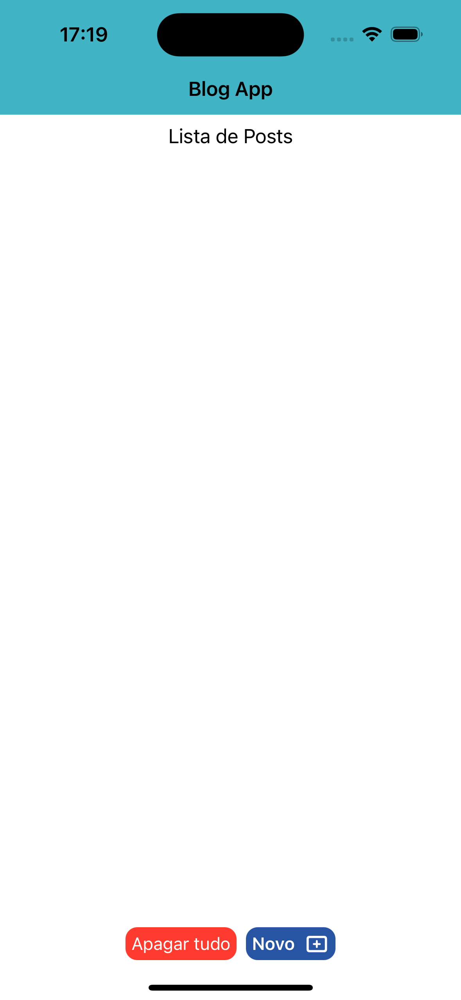
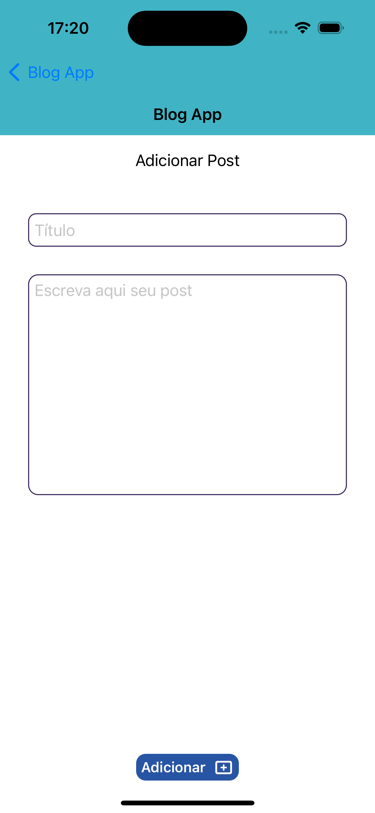
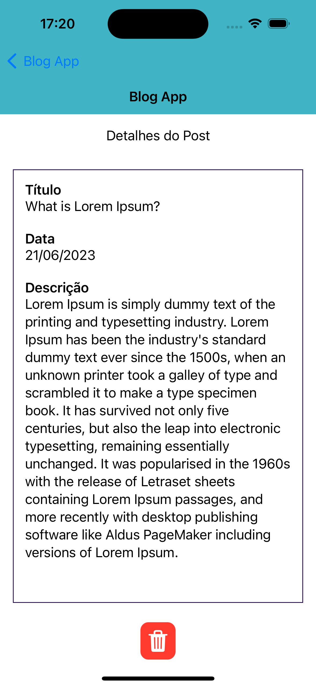

# desafio-dti

Olá!
Nesse repositório você vai encontrar a solução do desafio técnico, etapa do processo seletivo da dti, para vaga de Desenvolvimento IOS

## Informações técnicas

### Versões usadas:
Xcode 14.2  
iOS 16.2  
Simulador iPhone 14 Pro

### Abordagem, arquitetura e Persistência
SwiftUI, MVVM e UserDefaults (adicionar, listar e remover)

Fiz a escolha me baseando no que tenho mais familiaridade, assim consegui entregar aplicação em tempo hábil, cumprindo o máximo de requisitos e dando atenção também aos bônus

### Informação referente ao layout:
São 3 telas, sendo elas:
- Home: Lista de posts com botão adicionar;
- Detalhes: Exibe título, data e descrição do post específico
- Adicionar: Campo para adição de título e descrição  
  
As cores escolhidas são as mesmas usadas na comunicação visual da dti (roxo, azul escuro e azul esverdeado), para isso, criei cores customizadas

| Home vazia |  Adicionar vazia | Adicionar preenchida |  Home com post |   Detalhes |
|------------|-------------|------------|-------------|-------------|
|   |   |   |   |   |
  
## Caminho feliz do app

1. Inicar o app
2. Visualizar tela Home que contém título da navbar (este se repete em todas as telas) e da tela, nenhum post e 2 botões (Apagar tudo e Novo +)
3. Tocar em Novo +
4. Direcinar para tela de Adicionar Post (título da tela), esta contém 2 TextFields (título do post e sua descrição) e 1 botão (Adicionar +)
5. Tocar em Adicionar +
6. Tocar no botão de retorno
7. Direcionar para Home que exibe 1 post (título e data do dia)
8. Tocar no post
9. Direcionar para tela de Datelhes que contém título, data da criação, descrição do post criado e botão excluir (funcionalidade não executada pois, conforme instrução, não era necessário)
10. Tocar no botão de retorno
11. Tocar no botão Apagar tudo
12. A tela Home deve ficar vazia (sem posts) novamente

### Obs1:
caso o app seja finalizado (quit), aberto novamente e caso haja posts na Home, estes devem ser persistidos

### Obs2:
caso haja muitos posts adicionados, é possível realizar rolagem na vertical

### Obs3:
não é possível adicionar post cujo campos de título e/ou descrição estajam vazios. Caso haja essa tentativa, o app não realiza nenhuma ação

| Comportamento |
|------------|
|  |

## Bônus (extra)

- Ambas ViewModels possuem testes unitários
- Funcionalidade do botão Apagar tudo, pois funcionalidade para deletar post não foi solicitada
  