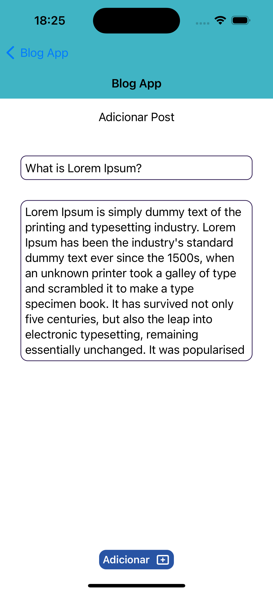

# desafio-dti

Olá!
Nesse repositório você vai encontrar a solução do desafio técnico, etapa do processo seletivo da dti, para vaga de Desenvolvimento IOS

## Informações técnicas

### Diferença de código entre Main e Branch bonus
Na Main, está o código com UserDefaults na persistência e tem o comportamento desejado preservado  
Na Branch bonus, acrescentei api local com dados mockados, onde é possível realizar requisição e printar o resultado, não influenciando na aplicação principal. Todos os detalhes abaixo na parte [Bônus (extra)](#bônus-extra)

### Versões usadas:
Xcode 14.2  
iOS 16.2  
Simulador iPhone 14 Pro

### Abordagem, arquitetura e persistência
SwiftUI, MVVM e UserDefaults (adicionar, listar e remover)

Fiz a escolha me baseando no que tenho mais familiaridade, assim consegui entregar aplicação em tempo hábil, cumprindo o máximo de requisitos e dando atenção também aos bônus

### Informação referente ao layout:
São 3 telas, sendo elas:
- Home: Lista de posts com botão adicionar;
- Detalhes: Exibe título, data e descrição do post específico
- Adicionar: Campo para adição de título e descrição  
  
As cores escolhidas são as mesmas usadas na comunicação visual da dti (roxo, azul escuro e azul esverdeado), para isso criei cores customizadas

| Home vazia |  Adicionar vazia | Adicionar preenchida |  Home com post |   Detalhes |
|------------|-------------|------------|-------------|-------------|
|   |   |   |   |   |
  
## Caminho feliz do app

1. Inicar o app
2. Visualizar tela Home que contém título da navbar (este se repete em todas as telas) e da tela, nenhum post e 2 botões (Apagar tudo e Novo +)
3. Tocar em Novo +
4. Direcinar para tela de Adicionar Post (título da tela), esta contém 2 TextFields (título do post e sua descrição) e 1 botão (Adicionar +)
5. Tocar em Adicionar +
6. Tocar no botão de retorno
7. Direcionar para Home que exibe 1 post (título e data do dia)
8. Tocar no post
9. Direcionar para tela de Datelhes que contém título, data da criação, descrição do post específico e botão excluir (funcionalidade não executada pois, conforme instrução, não era necessário)
10. Tocar no botão de retorno
11. Tocar no botão Apagar tudo
12. A tela Home deve ficar vazia (sem posts) novamente

### Obs1:
se o app for finalizado (quit) e aberto novamente, caso haja posts na Home, estes devem ser persistidos

### Obs2:
caso haja muitos posts adicionados, é possível realizar rolagem na vertical

### Obs3:
não é possível adicionar post cujo campos de título e/ou descrição estajam vazios. Caso haja essa tentativa, o app não realiza nenhuma ação

| Comportamento |
|------------|
|  |

# Bônus (extra)

- Ambas ViewModels possuem testes unitários (XCTest)
- Funcionalidade do botão Apagar tudo, pois ação para deletar post não foi solicitada

## Branch bonus

Optei por colocar o código com api local nessa branch, pois as requisições estão sendo realizadas com mock, assim não há interferência no comportamento da aplicação principal que está funcionando com UserDefaults

### Tecnologia usada
- Cocoapods
- Alamofire v5.7
- NodeJS v18.16.1
- Express

### Comandos que podem ser úteis

Para instalar `Cocoapods` 
```
sudo gem install cocoapods

pod setup --verbose

pod init
```
Para fazer download do `NodeJS`, acesse `https://nodejs.org/en`  
Inicie pacote `NodeJS` com 
```
npm init -y
```
Para instalar `Express`, use
````
npm i express@4.17.1 --save-exact
````
Para instalar `nodemon`, use
````
npm i nodemon@2.0.15 --save-dev --save-exact
````
Para iniciar a api, você pode usar
````
npm start
ou
npm run dev
````
(o segundo, mantém aplicação sendo atualizada, enquanto o primeiro é preciso encerrar e iniciar novamente para visualizar alteração)

### Como está organizada api

A porta usada é a `3001`  
Url padrão ficou `http://localhost:3001/posts`

Método `GET`, possui 2 rotas, ambas com mock:
-  `/` que retorna uma lista simples de apenas 1 item
-  `/posts` que retorna também retorna uma lista, só que com 2 itens

Método `POST`, adiciona a lista recebida no body (caso teste com um software como Insomnia, por exemplo)

No app, existe a camada `Service` onde as requisições estão sendo feitas  
Usei `Alamofire` para `GET` e `POST`, ambos estão printando informação no console  
Estão sendo trigadas durante a aplicação através da ViewModel:
- `GET` na função `get()` da `PostsViewModel`, chamada assim que a aplicação inicia
- `POST` na função `addNew()` da `AddPostViewModel`, chamada ao adicionar um novo post

## Considerações finais
Excelente proposta de desafio!  
Foi possível aplicar vários dos meus conhecimentos, ao mesmo tempo pude aprender novas abordagens também. Fiquei muito feliz em realizá-lo  
Certamente é algo que quero ter no meu portfólio.  
Espero que goste e me coloco [à disposição](https://www.linkedin.com/in/carolbezerra-dev/) para dúvidas e/ou sugestões de melhoria (sempre bem-vindas).
